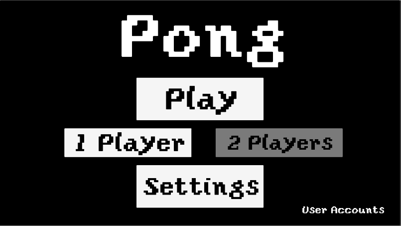
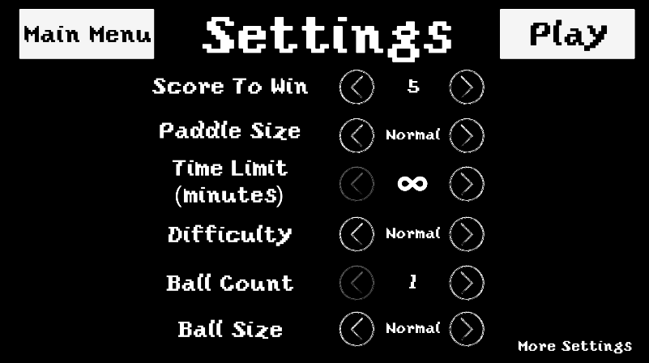
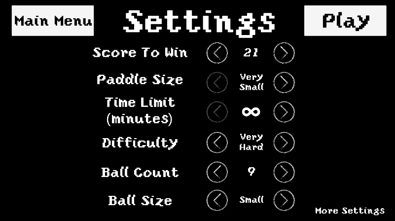
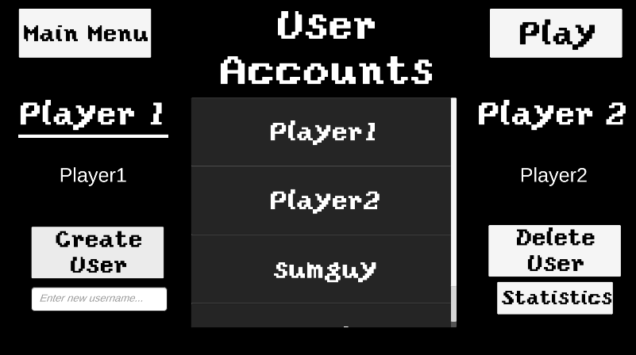

# Pong

This project is a Pong clone that was made with the Unity Engine and programmed in C#. It includes the ability to play with a friend or play against an A.I.

The game is customizable allowing the user to choose different settings such as: difficulty, ball size, ball count, paddle size, score to win, and time to win. These settings make for a more unique experience every time the game is played. 

Also, the user can choose custom colors for the background, the paddle, and the ball to make the game their own. 

User accounts can be added and deleted at will and all stats are saved and can be accessed from the user accounts menu.

This game is not fully finished by any means and I'm sure the code could be improved (refactored, optimized, etc.), but this was mainly for my own education and to make something interesting without spending too much time on it. I was inspired by the "That 70's Show" episode where Kelso and Red made smaller paddles for Pong because it was too easy for them lol.

# To Download and Play
For whatever operating system you are on, go to the releases tab or <https://github.com/szmyty/Pong/releases> and download the zip file for your operating system. You can just run the Pong executable file and should be good to go. 